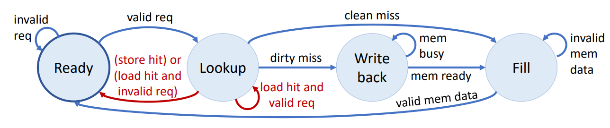

# An optimized RISC-V processor
A pipelined RISC-V processor with realistic memory system built using the Minispec HDL_1 and Assembly language, optimized for performance on a quicksort algorithm. Completed as a final project in MIT 6.191_{6.004} Fall 2022. 

Features:
* Processor has a real memory system with customized instruction and data caches. Instruction cache uses a direct mapped cache while data cache uses a two-way cache. 
* Processor uses 4-stage pipeline with bypassing following the state-transition diagram below:

* Minimized runtime of processor on quicksort by minimizing clock time and increasing CPI (cycles per instruction) 
* Added Hoare partitioning and strategically designed code of the quicksort algorithm to minimize stalling in the processor's pipeline 

Notes:
1. Minispec is a custom verson of Bluespec System Verilog
2. All relevant files are in `/src`. Key files for processor functionality are `Processor.ms`, `Decode.ms`, `Execute.ms`, `ALU.ms`, `CacheHelpers.ms`, `DirectMappedCache.ms`, `TwoWayCache.ms`. Sorting code in is in `/src/sw/sort/sort.S`.
